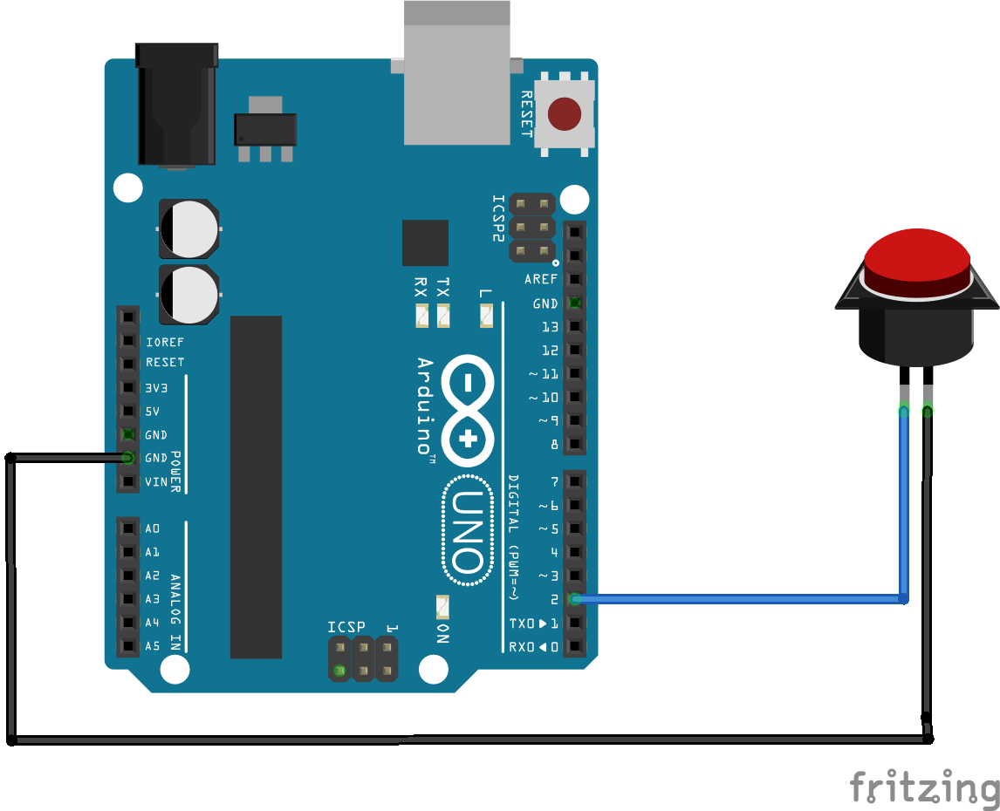

# abit-queue-button-arduino
Button arduino firmware. Arduino will be used as com port and it will print message each time button pressed.

## Usage
Flash this firmware to your Arduino, connect Button as it showed at the picture.

